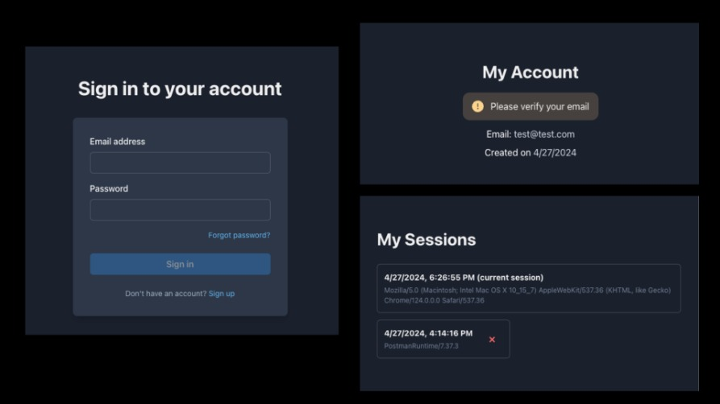
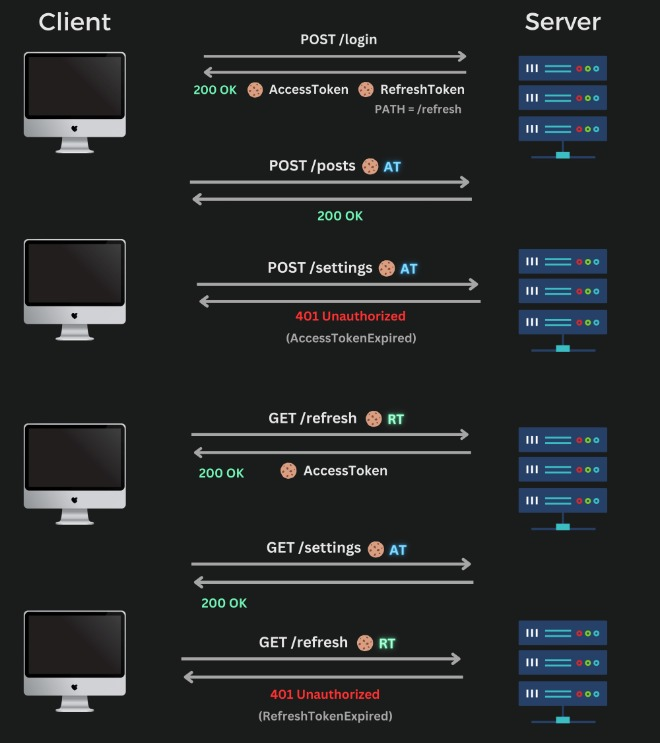

# MERN Authentication Template (JWT)

This is a starter template for a MERN stack application using JSON Web Tokens (JWT). The backend is built with [TypeScript](https://www.typescriptlang.org/), [Express](https://expressjs.com), [MongoDB](https://www.mongodb.com) and [Resend](https://resend.com) (for sending emails). There is also a Postman collection for testing the API. JWTs are stored in secure, HTTP-only cookies. The frontend is built with [React](https://react.dev), [Chakra UI](https://chakra-ui.com) and [React Query](https://tanstack.com/query/latest).

Includes:

- register, login, logout, profile, account verification, password reset
- send emails for account verification and password reset
- get and remove sessions
- frontend forms for login, register, reset password, etc.
- custom react hooks to manage auth state & application data



## API Architecture

The API is built using different layers: routes, controllers, services and models.

- Routes are responsible for handling the incoming requests and forwarding them to the appropriate controller.
- Controllers are responsible for validating the request, calling the appropriate service, and sending back the response.
- Services are responsible for handling the business logic. They interact with the database and any external services. Services may also call other services.
- Models are responsible for interacting with the database. They contain the schema and any model utility methods.

\*\*\* For simple GET or DELETE requests that don't require any business logic, the controller may directly interact with the model.

#### Error Handling

Errors are handled using a custom error handler middleware. The error handler middleware catches all errors that occur in the application and processes them accordingly. Each controller needs to be wrapped with the `errorCatch()` utility function to ensure that any errors that are thrown within the controller are caught and passed on to the error handler middleware.

## Authentication Flow

When a user logs in, the server will generate two JWTs: `AccessToken` and `RefreshToken`. Both JWTs are sent back to the client in secure, HTTP-only cookies. The AccessToken is short-lived (15 minutes) and is passed on EVERY request to authenticate the user. The RefreshToken is long-lived (30 days) and is ONLY sent to the `/refresh` endpoint. This endpoint is used to generate a new AccessToken, which will then be passed on subsequent requests.

The frontend has logic that checks for `401 AccessTokenExpired` errors. When this error occurs, the frontend will send a request to the `/refresh` endpoint to get a new AccessToken. If that returns a 200 (meaning a new AccessToken was issued), then the client will retry the original request. This gives the user a seamless experience without having to log in again. If the `/refresh` endpoint errors, the user will be logged out and redirected to the login page.



## Run Locally

To get started, you need to have [Node.js](https://nodejs.org/en) installed. You also need to have MongoDB installed locally ([download here](https://www.mongodb.com/docs/manual/installation/)), or you can use a cloud service like [MongoDB Atlas](https://www.mongodb.com/atlas/database). You will also need to create a [Resend](https://resend.com) account to send emails.

Clone the project

```bash
git clone https://github.com/nikitapryymak/mern-auth-jwt.git
```

Go to the project directory

```bash
cd mern-auth-jwt
```

Navigate to the backend directory

```bash
cd backend
```

Use the right node version (using [nvm](https://github.com/nvm-sh/nvm))

```bash
nvm use
```

Install Backend dependencies

```bash
npm install
```

Before running the server, you need to add your ENV variables. Create a `.env` file and use the `sample.env` file as a reference.
For development, you can set the `EMAIL_SENDER` to a random string, since the emails are sent with a resend sandbox account (when running locally).

```bash
cp sample.env .env
# open .env and add your variables
```

Start the MongoDB server (if running locally)

```bash
# using homebrew
brew services start mongodb-community@7.0
```

Start the API server

```bash
# runs on http://localhost:4004 (default)
npm run dev
```

Navigate to the frontend directory & install dependencies

```bash
cd ../frontend
npm install
```

Create a `.env` file at the root and add the `VITE_API_URL`. This is the URL of the backend API.

```bash
VITE_API_URL=http://localhost:4004
```

Start the dev server

```bash
# runs on http://localhost:5173
  npm run dev
```

### Postman Collection

There is a Postman collection in the `backend` directory that you can use to test the API. The `postman.json` contains requests for all the routes in the API. You can [import the JSON directly](https://learning.postman.com/docs/getting-started/importing-and-exporting/importing-data/#import-postman-data) into Postman.

## 🛠️ Build

To build either the frontend or backend, run the following command in the respective directory:

```bash
npm run build
```

To test the compiled API code, run:

```bash
# this runs the compiled code in the dist directory
npm run start
```
